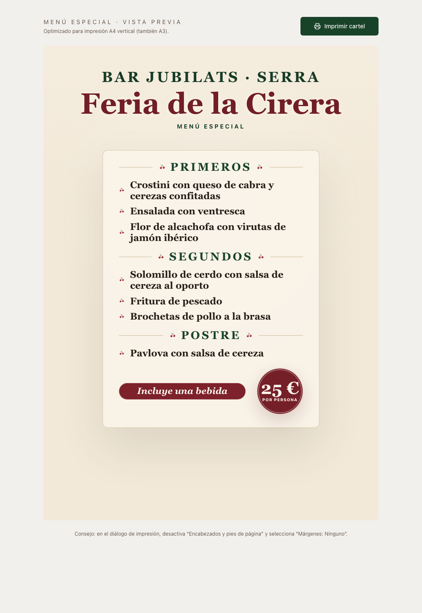

# 📸 Vista Previa del Nuevo Diseño (Rama `feature/mejoras-cartel-cerezas`)

¡Aquí tienes la previsualización del cartel renderizado directamente desde tu servidor local con las nuevas propuestas!

---

## 🎨 Cambios Implementados en esta Rama:

1. **Fusión de Estilo Botánico Vintage:**
   * Las fotos de cerezas (`cherries.jpg`, `cherries1.jpg`, `cherries2.jpg`) tienen filtros CSS aplicados (`sepia(0.18) saturate(0.85) contrast(1.05)`) para simular un grabado a mano antiguo en papel.
2. **Composición de "Gravedad Invertida":**
   * La imagen de las cerezas (`cherries1.jpg`) ahora cuelga elegantemente en la esquina superior izquierda.
   * Las montañas, pinos y el boceto del castillo a lápiz quedan **100% libres y despejados** en la base.
3. **Detalles SVG (Más Cerezas):**
   * **Separadores de sección:** Delicados iconos vectoriales de dos cerezas flanqueando *"Primeros"*, *"Segundos"* y *"Postre"*.
   * **Viñetas (Bullet Points):** Cada plato tiene una diminuta cereza SVG en lugar de círculos planos.
4. **Wording:** Redactado como *"Incluye una bebida"*.

---

### 🌐 ¿Cómo ver el diseño interactivo?
El servidor de desarrollo local sigue corriendo. Puedes visitarlo en tu navegador:
👉 **[http://localhost:8080/](http://localhost:8080/)**

*Nota: Todos los cambios están empaquetados de forma limpia en tu Pull Request #11.*
